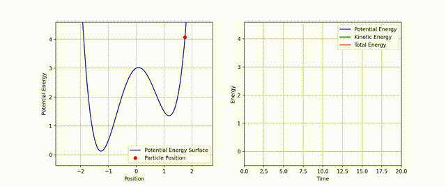

# MD-playground: A Minimal Molecular Dynamics Engine in Python

## About
MD-playground is a Python-based molecular dynamics (MD) simulation engine designed for simplicity and extensibility. The engine is capable of simulating:
- Simulations of single particles in various potentials.
- Dynamics in both NVE (microcanonical) and NVT (canonical) ensembles.
- Advanced enhanced sampling techniques like Metadynamics.

## Key Features
- **Integrators**: 
  - Velocity Verlet for time integration.
- **Thermostats**: 
  - Optional temperature control for NVT ensemble.
- **Potentials**: 
  - Predefined potentials, including Harmonic and Double-Well.
- **Enhanced Sampling**: 
  - Metadynamics to accelerate rare event sampling.

## Getting Started
### Installation
Clone the repository:
```bash
git clone https://github.com/mandal13/MD-playground.git
cd MD-playground
```

### Example Simulation
Run the simulation with:
```bash
python main.py --animation --potential double_well --positions 1.75 --save_file animation.mp4
ffmpeg -i animation.mp4 -vf "fps=30,scale=640:-1:flags=lanczos" animation.gif
```



